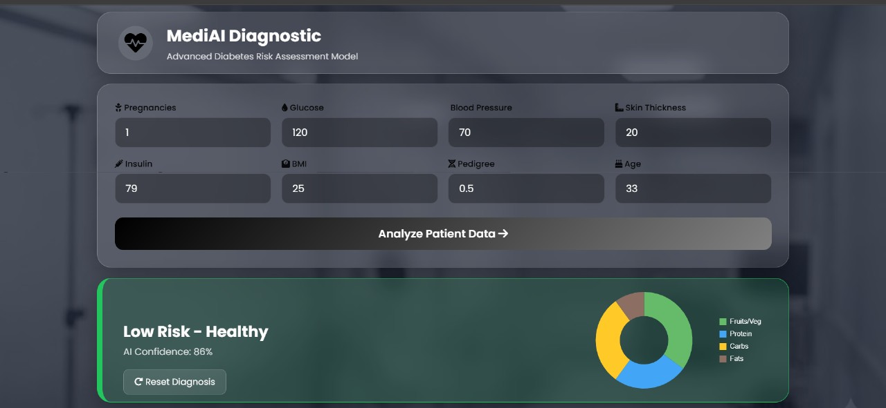

# 🩺 MediAI | Intelligent Diabetes Diagnostic Tool

**MediAI** is a full-stack health-tech application that uses Machine Learning to assess the risk of diabetes. It bridges the gap between complex Data Science models and user-friendly web interfaces, featuring a stunning "Glassmorphism" UI and interactive data visualization.



## 🚀 Key Features

* **🧠 AI-Powered Diagnosis:** Utilizes a **Random Forest Classifier** trained on the Pima Indians Diabetes Database to predict risk levels.
* **📊 Dynamic Visualization:** Automatically renders personalized diet recommendation charts using **Chart.js** based on the diagnosis.
* **🎨 Modern UI/UX:** Features a "Dark Glassmorphism" aesthetic with a responsive split-screen layout, CSS animations, and medical iconography.
* **⚡ Instant Analysis:** Uses AJAX (Fetch API) to communicate with the Flask backend, providing instant results without page reloads.
* **🛡️ Risk Context:** Provides actionable feedback (confidence score + health recommendation) rather than just a raw prediction.

## 🛠️ Tech Stack

### Data Science & Logic
* **Python** (Core Logic)
* **Scikit-learn** (Random Forest Algorithm)
* **Pandas & NumPy** (Data Processing)
* **Pickle** (Model Serialization)

### Web Development
* **Flask** (Backend API)
* **JavaScript (ES6)** (Frontend Logic & Async Fetch)
* **Chart.js** (Data Visualization)
* **CSS3** (Flexbox, Grid, Glassmorphism Effects)

## ⚙️ Installation & Setup

Follow these steps to set up the project locally.

### 1. Clone the Repository
```bash
git clone [https://github.com/krissshnaverrrma/Diabetes-APP.git](https://github.com/krissshnaverrrma/Diabetes-APP.git)
cd mediai-diabetes-tool